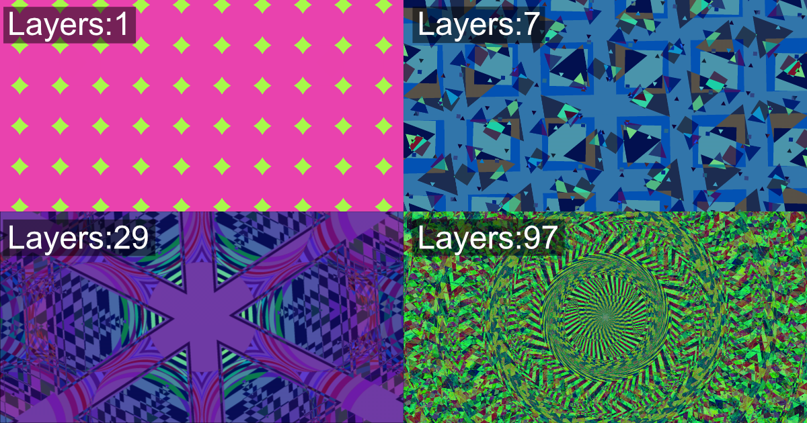

# Kaleidoscope Web Screensaver

🌐 Live Site: https://wraith13.github.io/kaleidoscope/

## Introduction

Kaleidoscope Web Screensaver is a web-based screensaver that displays kaleidoscope-like animations. Users can customize patterns and colors to create simple yet visually engaging effects reminiscent of a kaleidoscope. It works on various devices, including PCs, smartphones, and tablets, and supports fullscreen mode.

By increasing the number of layers, users can create even more beautiful and intricate visuals. However, please note that higher layer counts may also increase the computational load, which could affect performance on less powerful devices.

In addition, Kaleidoscope Web Screensaver includes a benchmark feature that measures the overall performance of your device and web browser together.

This software can be hosted and shared using GitHub Pages, making it easy to use for personal enjoyment or demonstrations.

## Feature

- Kaleidoscope Animation with customizable patterns and colors
- Web Benchmark
- Color spaces: sRGB, Display P3, Rec. 2020
- Patterns (powered by [flounder.style.js](https://github.com/wraith13/flounder.style.js)): Lines, Spots, Both
- Colorings: Monochrome, Primary Colors, Phi Colors (powered by [phi-colors](https://github.com/wraith13/phi-colors))
- Adjustable Layers: 1 - 97
- Cycle Span: 1s - 1h
- Fullscreen Support
- Show Clock: Hide, Blend, White, Black, System, Alternate, Rainbow
- Multi-language Support: العربية(ar), Deutsch(de), Ελληνικά(el), English(en), Español(es), فارسی(fa), Français(fr), हिन्दी(hi), Bahasa Indonesia(id), Italiano(it), 日本語(ja), 한국어(ko), Português(pt), Русский(ru), ไทย(th), Türkçe(tr), Tiếng Việt(vi), 简体中文(zh-cn), 繁體中文(zh-tw)
- Device Compatibility: PCs, Smartphones, Tablets
- Keyboard Shortcuts Support for easier operation

## Screenshots




## Options Available via URL Parameters

The following options cannot be set via the UI.

- `clock-locale`: Specifies the locale used for the clock display. (Example: [`?clock-locale=en-us`](https://wraith13.github.io/kaleidoscope/?clock-locale=en-us&clock=blend))
- `screenshot`: Specifies the screenshot mode. Accepts one of `favicon`, `twitter-card`, `black`, or `sample`. (Example: [`?screenshot=sample`](https://wraith13.github.io/kaleidoscope/?screenshot=sample))

## How to build

### Prerequisites

- Node.js (version 16 or higher recommended)
- npm (Node Package Manager)

### Steps

1. Install dependencies:
   ```sh
   npm install
   ```
2. Build the project:
   ```sh
   npm run-script "build all"
   ```

## Build commands


( You can see this diagram in VS code with [Markdown Preview Mermaid Support extension](https://marketplace.visualstudio.com/items?itemName=bierner.markdown-mermaid). )

- `npm run-script "build all"`
- `npm run-script "build locale script"`
- `npm run-script "build locale"`
- `npm run-script "build web.manifest"`
- `npm run-script "build style"`
- `npm run-script "build script"`
- `npm run-script "build html"`


## Files

|path|description|
|---|---|
|[`./README.md`](./README.md)|Generated file|
|[`./README.template.md`](./README.template.md)|README template|
|[`./build.json`](./build.json)|Build settings|
|[`./index.html`](./index.html)|Generated file for GitHub Pages deployment|
|[`./index.html.template`](./index.html.template)|HTML template|
|[`./resource/*.json`](./resource/)|JSON files for configuration or data|
|[`./style/*.scss`](./style/)|Style source files|
|[`./script/*.ts`](./script/)|Script source files|
|[`./image/*.*`](./image/)|Image files used in the project|

## Powered by

- [build.js](https://github.com/wraith13/build.js)
- [evil-commonjs](https://github.com/wraith13/evil-commonjs)
- [evil-timer.js](https://github.com/wraith13/evil-timer.js)
- [flounder.style.js](https://github.com/wraith13/flounder.style.js)
- [phi-colors](https://github.com/wraith13/phi-colors)

## License

[Boost Software License](./LICENSE_1_0.txt)
